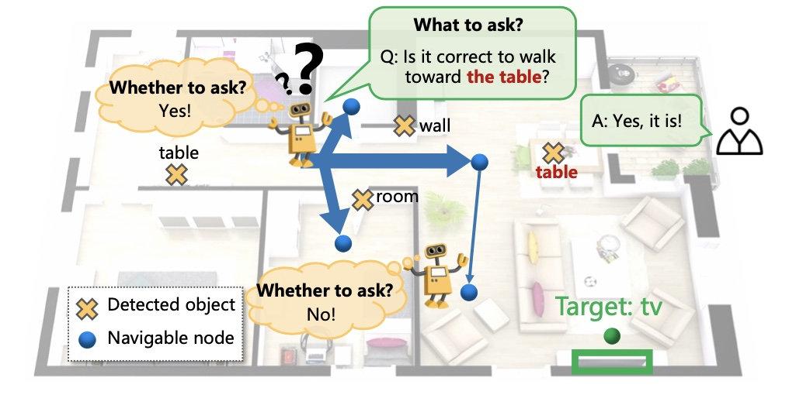

# PyTorch implementation of Self-Motivated Communication Agent
This repository contains code for the paper [**Self-Motivated Communication Agent for Real-World Vision-Dialog Navigation**]() ICCV 2021.




## Installation
We recommend using the mattersim [Dockerfile](Dockerfile) to install the simulator. The simulator can also be [built without docker](https://github.com/peteanderson80/Matterport3DSimulator#building-without-docker) but satisfying the project dependencies may be more difficult.

### Requirements
- Ubuntu 16.04
- Nvidia GPU with driver >= 384
- Install [docker](https://docs.docker.com/engine/installation/)
- Install [nvidia-docker2.0](https://github.com/nvidia/nvidia-docker/wiki/Installation-(version-2.0))
- Note: CUDA / CuDNN toolkits do not need to be installed (these are provided by the docker image)


### Dataset Download

Download the `train`, `val_seen`, `val_unseen`, and `test` splits by executing the following script:
```
tasks/SCoA/data/download.sh
```

### Build experimental environment
Build the docker image:
```
docker build -t mattersim .
```

Run the docker container, mounting your project path:
```
nvidia-docker run -it --shm-size 64G -v /User/home/Path_To_Project/:/Workspace/ mattersim
```

Compile the codebase:
```
mkdir build && cd build
cmake -DEGL_RENDERING=ON ..
make
```

Install python dependencies by running:
```
pip install -r tasks/SCoA/requirements.txt
```

## Train and Evaluate
To train and evaluate with player path supervision:
```
python tasks/SCoA/train.py \
--prefix=v1 \
--batch_size=40 \
--path_type=player_path 
```

checkpoint resume (take `iter=100` as example):
```
python tasks/SCoA/train.py \
--prefix=v1 \
--batch_size=40 \
--path_type=player_path \
--start_iter=100 \
--encoder_save_path=path_to_encoder_model \
--decoder_save_path=path_to_decoder_model \
--critic_save_path=path_to_critic_model \
--WeTA_save_path=path_to_WeTA_model \
```

Test: emphasize `eval_type=test` (default is `eval_type=val`)
```
python tasks/SCoA/train.py \
--prefix=v1 \
--batch_size=40 \
--path_type=player_path \
--eval_type=test \
--start_iter=100 \
--encoder_save_path=path_to_encoder_model \
--decoder_save_path=path_to_decoder_model \
--critic_save_path=path_to_critic_model \
--WeTA_save_path=path_to_WeTA_model \
```

We list some common options below. More options can be seen in `tasks/SCoA/param.py`.

| Option  | Possible values  |
|---|---|
| `prefix` | Any string without space |
| `batch_size` | Positive integer |
| `path_type`  | 'planner_path', 'player_path', 'trusted_path'   |
| `eval_type`  | 'val', 'test', 'val_seen', 'val_unseen' |


## Citation
If you cite our paper in your research, please cite:
```bibtex
@inproceedings{zhuyi:iccv2021,
  title={Self-Motivated Communication Agent for Real-World Vision-Dialog Navigation},
  author={Yi Zhu* and Yue Weng* and Fengda Zhu and Xiaodan Liang and Qixiang Ye and Yutong Lu and Jianbin jiao},
  booktitle={ICCV},
  year={2021}
}
```


## Acknowledgements

This repository is built upon the [Matterport3DSimulator](https://github.com/peteanderson80/Matterport3DSimulator) and [CVDN](https://github.com/mmurray/cvdn).
